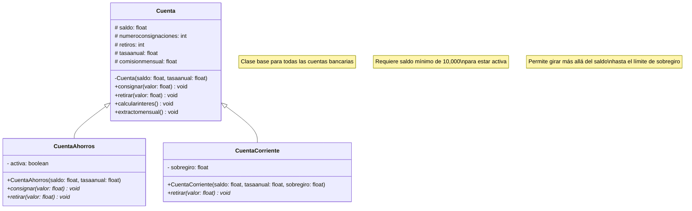

# Sistema de Cuentas Bancarias

## Diagrama UML

## Descripción

- **Cuenta**: Clase base que define las operaciones bancarias básicas (consignaciones, retiros, cálculo de intereses)
- **CuentaAhorros**: Hereda de Cuenta con validación de saldo mínimo de 10,000
- **CuentaCorriente**: Hereda de Cuenta con soporte para sobregiro

